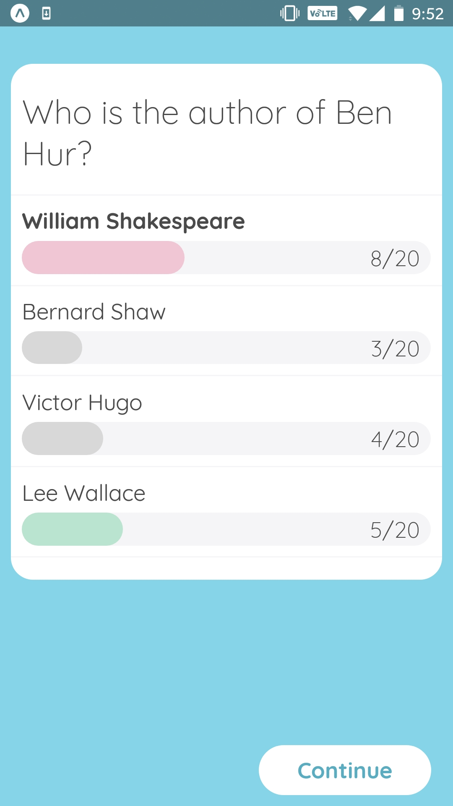

## Example App as proof of concept for Expos' built in push notifications

[Build it here](https://learn.handlebarlabs.com/p/master-push-notifications-in-react-native)

Based on the [Trivia Example App](https://github.com/HandlebarLabs/trivia-app). View that repo for additional documentation.

# React Native App

## Getting Started

This app is built on top of Expo so the first requirement is to install [Expo](https://expo.io/learn).

After cloning the repo and moving into the `mobile` directory run the following command:

- `yarn install` - Installs dependencies

You may need to delete yarn.lock first
You can then open the app from within the Expo XDE (or the command line) and run it from there.

# Server

## Getting Started

After cloning the repo and moving into the `server` directory run the following commands:

- `yarn install` - Installs dependencies
- `yarn run db:migrate-latest` - Creates the database (based on sqlite)
- `yarn run db:seed` - Seeds the database with some data

## Usage

- `yarn start` - Starts the server, making it accessible on `http://localhost:3000`
